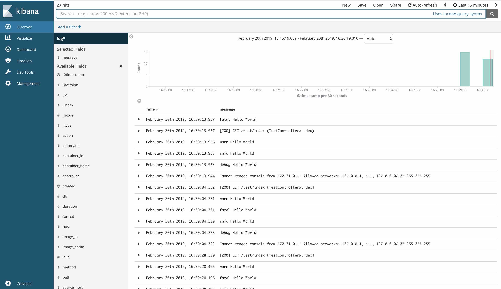

# Sample app: Logging solution for Ruby on Rails + Docker + ELK
2019-2-20   
This example show you how to do logging with `Ruby on Rails` + `Docker` + `ELK`

The point of this repo is give you a quick "up and running" example.    
so you can try things out instead of writing `docker-compose.yml`.   

Note: I haven't use this in production yet.   
I am also learning how to properly do it.  


## Huge Thanks to
https://github.com/hugodias/rails-elk-stack    
This example Rails app is base on this repo.    

## How to run
### Step 1:  
```
git clone https://github.com/1c7/rails_2019-2-20_elk.git
cd rails_2019-2-20_elk/
docker-compose up --build
```
### Step 2:  
Visit `http://localhost:3000/test/index`   

It would output some log.   
(code is in `app/controllers/test_controller.rb`)    

### Step 3:  
Visit `http://localhost:5601`  
for Kibana     



### Note
Just change Ruby on Rails source code however you want,    
Output some log.    
And watch it in Kibana   